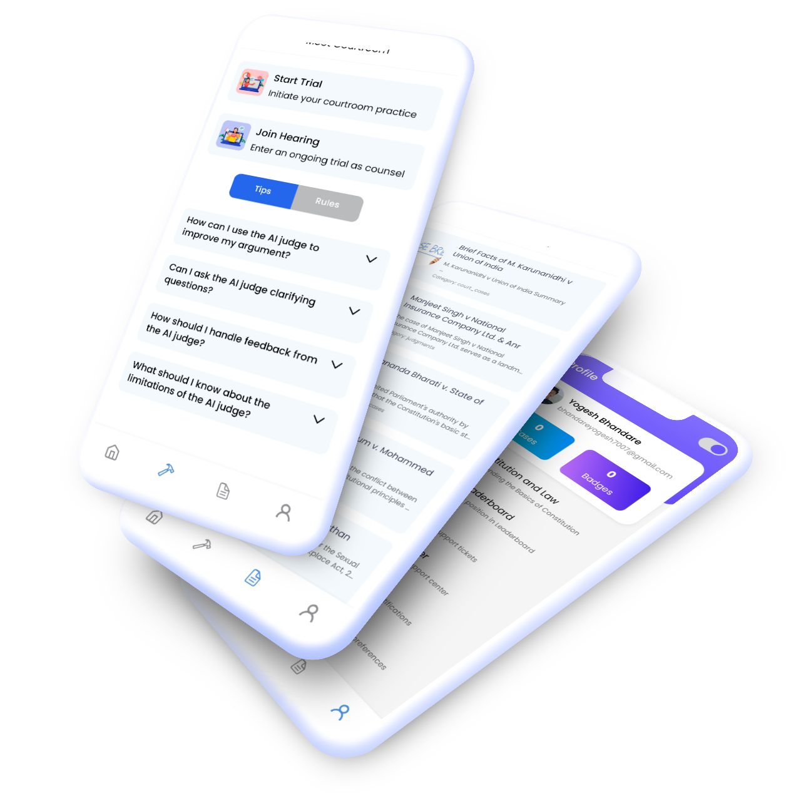

# Lawbook Backend API

This repository contains the backend API for the Lawbook mobile app, a platform redefining legal practice for students. Built on FastAPI, this backend powers the virtual moot court, AI-driven features, and data management, seamlessly integrating with the React Native frontend.

### Overview

Lawbook is a cross-platform mobile app designed to revolutionize how law students practice and prepare for trials. By providing a virtual moot court, AI-driven tools, and an extensive case library, Lawbook enables students to refine their legal skills, gain confidence in courtroom proceedings, and excel in their academic and professional pursuits.

### Motivation

Preparing for trials and judgments is often limited to theoretical knowledge or traditional moot court setups. Lawbook bridges this gap by offering a realistic, interactive platform for law students to practice, collaborate, and learn in a virtual environment. The app fosters critical thinking and analytical skills, helping students navigate the complexities of legal practice with ease.


### Features
   - **Virtual Moot Court:** Simulate real-life trials via video chat with an AI judge or real participants as judges and opponents.
   - **Document Presentation:** Present, share, and annotate documents during virtual courtroom sessions.
   - **AI Summarized Case Library:** Access a vast repository of cases and judgments, summarized using advanced AI tools.
   - **Progress Tracking:** Monitor skill development with milestone-based badges and detailed performance analytics.

### Tech Stack

- **[FastAPI](https://fastapi.tiangolo.com/)** (`pip install "fastapi[all]"`) - High-performance web framework for building APIs.
- **[LLMs (e.g., OpenAI)](https://openai.com)** - Flexible integration with any LLM, powered by LangChain and LangServe for AI-driven features.
- **[Redis](https://redis.io)** - Used with Celery for rate limiting, task queuing, and caching.
- **[Celery](https://docs.celeryproject.org)** - Asynchronous task processing for background jobs.
- **[Vector DB](https://www.pinecone.io/)** - Embedding-based comparison for case similarity and search (e.g., Pinecone or similar).
- **[PostgreSQL](https://www.postgresql.org/)** - Relational database for user data, case metadata, and other storage needs.
- **[AWS](https://aws.amazon.com)** - Deployment infrastructure with ECS/EC2 and S3 for file storage.
- **[GetStream](https://getstream.io/)** - Token generation logic for video/chat integration with the frontend.
- **[Python 3.11](https://www.python.org)** - Core programming language.
- **React Native Frontend** - See [Lawbook Frontend repo](https://github.com/yogesh-bhandare/Lawbook) for the client-side codebase.

## Getting Started

### Prerequisites

Download and install the following tools:
- **[Git](https://git-scm.com/)** - Version control system.
- **[VSCode](https://code.visualstudio.com/)** (or **[Cursor](https://cursor.com/)**) - Recommended IDEs.
- **[Python](https://www.python.org/downloads/)** - Ensure Python 3.11 is installed.
- **[PostgreSQL](https://www.postgresql.org/download/)** - Local database setup (or use Neon DB).
- **[Redis](https://redis.io/download)** - For rate limiting and task queuing.

### Setup Instructions

1. **Clone the Repository**
   ```bash
   mkdir -p ~/dev/lawbook-backend
   cd ~/dev/lawbook-backend
   git clone https://github.com/yogesh-bhandare/lawbook-api .
   ```

2. **Create a Python Virtual Environment**
   * **macOS/Linux/WSL:**
   ```bash
   python3.11 -m venv venv
   source venv/bin/activate
   ```
   * **Windows (PowerShell):**
   ```powershell
   c:\Path\To\Python311\python.exe -m venv venv
   .\venv\Scripts\activate
   ```

3. **Install Requirements**
   ```bash
   (venv) python -m pip install --upgrade pip
   (venv) python -m pip install -r requirements.txt
   ```

4. **Set Up Environment Variables**
   Create a `.env` file with keys:
   - OpenAI API key
   - Redis URL
   - PostgreSQL credentials
   - AWS keys
   - GetStream secrets

5. **Run the Server**
   ```bash
   (venv) uvicorn main:app --reload
   ```

### Running App
Download and use the Lawbook app to explore its features: [Download Lawbook App](https://lawbook-apk.s3.us-east-1.amazonaws.com/download/Lawbook.apk)



### License
This project is licensed under the MIT License. See the [LICENSE](LICENSE) file for details.

For the frontend codebase, visit [Lawbook Frontend](https://github.com/yogesh-bhandare/Lawbook).

